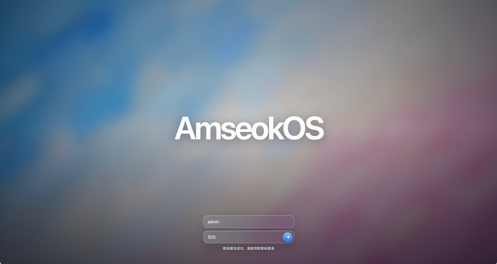
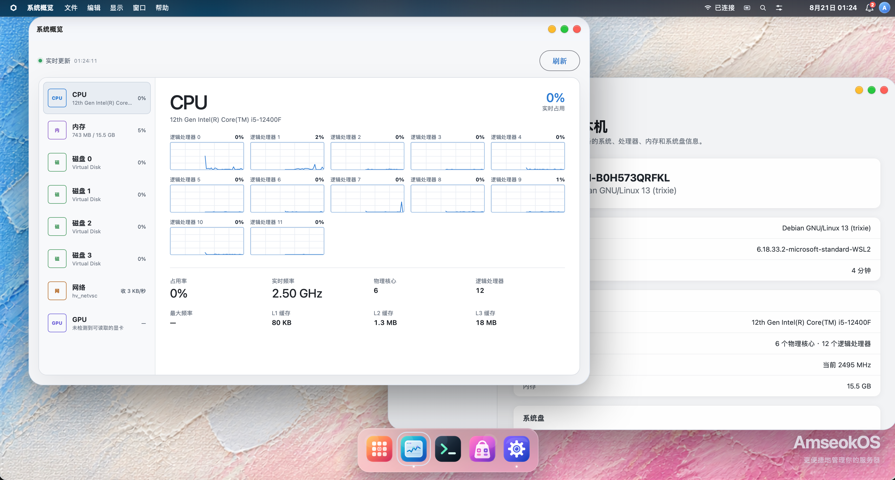

<p align="center">
  
</p>

<h1 align="center">AmseokOS</h1>

**让数据与 AI 留在本地。**<br>
*Keep your data and AI local.*

**统一管理私有数据、本地 AI、应用服务与计算资源。**<br>
*Manage private data, local AI, application services, and computing resources—all in one place.*

AmseokOS 是一个以 Debian 为底座的本地智能基础设施操作系统，通过统一的 Web 桌面管理私有存储、本地 AI、应用服务、网络与计算资源。

<p align="center">
  
</p>

<p align="center">
  
</p>

## 文档

- [C# 与 Rust 特权执行架构](AmseokOS-docs/csharp-rust-privileged-architecture.md)
- [数据库架构](AmseokOS-docs/database-architecture.md)
- [Debian 镜像与图形安装器架构](AmseokOS-docs/debian-image-installer-architecture.md)
- [单节点基础设施部署](AmseokOS-docs/single-node-infrastructure.md)
- [局域网 HTTPS 开发](AmseokOS-docs/development-https.md)
- [Web Terminal 部署与安全边界](AmseokOS-docs/web-terminal.md)
- [本地控制台状态页](AmseokOS-deploy/console/README.md)

## 安装部署

```sh
git clone https://github.com/AmseokTech/AmseokOS.git # 克隆 AmseokOS 源代码
cd AmseokOS # 进入项目目录
sudo bash AmseokOS-deploy/scripts/install-amseokos.sh # 安装软件包并部署 AmseokOS 服务
```

## 路线方向

1. 完成认证、数据保护、只读设备查询、Operation、资源锁和单节点协调等安全底座
2. 打通 `mdadm + ext4 + SMB` 的存储纵向闭环
3. 增加故障恢复、告警、备份与恢复演练
4. 在统一权限、审计和资源边界上扩展本地 AI、应用服务、容器与集群能力

详细阶段约束与当前验证记录见 [`agent.md`](agent.md)。项目实际状态始终以可运行代码和最新验证结果为准。

## 贡献

提交修改前请先阅读 [`AGENTS.md`](AGENTS.md) 和 [`agent.md`](agent.md)，遵守模块依赖方向、安全边界、测试和人工审查要求。不要在缺少完整预检、回滚和验证的情况下开放系统写入或危险操作。
